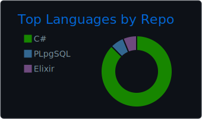

## 🗺️ Приветствую, путиник 👋

<!-- Изображение -->

  

<h3 align="left"> 🛠️ Мой стек технологий:</h3>

  
  
  
  
  
  
  
   
  
  
  
  
   
  
   

  

  
  
   
  
   

 

<!-- Доп список -->

  
<h3>🏛️ Архитектуры и Паттерны</h3>

  
  - 🎨 **Архитектурные стили:** `Чистая архитектура (Clean Architecture)`, `Микросервисы`, `Вертикальные срезы (Vertical Slice)`, `MVVM`.
  - 🧩 **Ключевые паттерны:** `CQRS`, `Repository & Unit of Work`.
  - 🧠 **Подход к проектированию:** `Domain-Driven Design (DDD)`.
  - 📐 **Базовые принципы:** `SOLID`, `KISS`, `DRY`.
    

  
<h3>🛠️ Инструменты и Библиотеки</h3>

  
  - 🗃️ **Работа с данными:** `Entity Framework Core`.
  - 📡 **Построение API:** `MediatR`, `FluentValidation`, `AutoMapper`.
  - ✅ **Тестирование:** `NUnit`, `Moq`.
  - 📝 **Логирование:** `Serilog`.
    

 

<!-- Показатели -->

<h3 align="left">📈 Моя статистика :</h3>

  
  

  

<!--

  

<!--    -->
